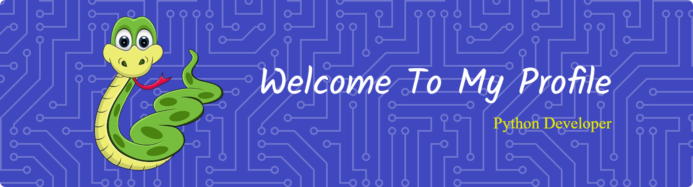

<h1 align="center">Hanif Neevera</h1> 
<h2 align="center">📊 AI & ML Enthusiast 📊</h2>

<h1 align="center">About Me</h1> 

I’m passionate about building intelligent systems that can learn and solve real-world problems. My focus is not just training models, but engineering how data transforms into smart insights and reliable AI-driven applications.

- 🔭 I’m currently working on AI-powered tools and predictive modeling projects
- 🌱 I’m currently learning Machine Learning workflows, Deep Learning, and Model Deployment
- 👯 I’m looking to collaborate on ML, NLP, or computer vision-based projects
- 🤔 I’m looking for help with optimizing model accuracy and handling real-world datasets
- 💬 Ask me about Python, Scikit-learn, Data Augmentation, and building AI automation
- 😄 Pronouns: He/Him
- ⚡ Fun fact: I find more joy in seeing a model finally "get it" after hours of training than the actual final prediction results

## 🌐 Socials
   

## 💻 Tech Stack
          

